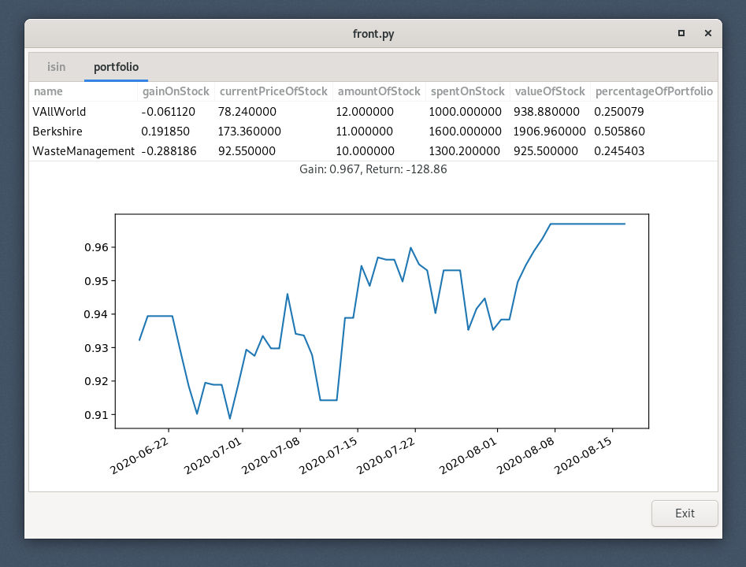

# portfolio

A small portfolio viewer. Many features are still missing such as dealing with splits.
It use pandas to read and manipulate the data. Front.py uses pyGTK and generates a GtkTreeView from a pandas dataframe.

To start it, run front.py.

